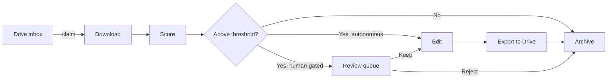

# BigBadPhotos

**A self-hosted photo culling, scoring, and export pipeline for photographers who shoot too many frames and don't want to sort them by hand.**

[](https://github.com/BigBadApps/BigBadPhotos/actions/workflows/build.yml)
[](LICENSE)
[](requirements.txt)
[](frontend/package.json)

BigBadPhotos scores every photo in a shoot for sharpness, exposure, noise, contrast, and subject quality (face/eye detection), groups burst sequences and picks the best frame from each, and gets your keepers where they need to go — with an optional bounded auto-edit or a Topaz Photo AI pass along the way. Run it as a one-off against a local folder, or create a named session pointing at a Google Drive inbox and let it run unattended.

---

## Table of contents

- [Features](#features)
- [How it works](#how-it-works)
- [Tech stack](#tech-stack)
- [Getting started](#getting-started)
- [Configuration](#configuration)
- [Workflows](#workflows)
- [Project structure](#project-structure)
- [Testing](#testing)
- [Deployment](#deployment)
- [Roadmap](#roadmap)
- [Contributing](#contributing)
- [License](#license)
- [Acknowledgments](#acknowledgments)

---

## Features

- **Automated quality scoring** — sharpness (Laplacian variance), exposure, noise, contrast, and face/eye detection (MediaPipe FaceMesh with an automatic OpenCV Haar-cascade fallback), combined into a single ranked score per photo.
- **Burst detection** — perceptual-hash grouping picks the sharpest, best-scoring frame out of each burst automatically.
- **Session-based pipeline** — named sessions tie a Drive inbox to an export folder, a keeper threshold, a review mode, and an edit mode. Create, configure, start, and monitor sessions from the Session Hub.
- **Autonomous or human-gated** — sessions can export keepers automatically, or queue them for human review before exporting.
- **Manual culling** — a fast, keyboard-driven review UI (keep / maybe / reject, `P`/`M`/`R` keys) with AI-powered filters (burst-best, top-20%, per-metric sorting).
- **Side-by-side compare** — stack-based pair comparison for difficult selections.
- **Optional editing** — a bounded, non-destructive "Auto" filter (exposure/contrast/white-balance/saturation) or a full [Topaz Photo AI](https://www.topazlabs.com/topaz-photo-ai) CLI pass, per session.
- **Preflight checks** — before a session starts, it verifies Google auth, both Drive folders, Topaz (if used), imaging libraries, disk space, and the database — each failure comes with a specific fix, not just a red X.
- **One-off mode** — score and cull a local folder without setting up Drive or creating a session.
- **Phone-first UI** — every view is designed to be used one-handed on a phone over Tailscale, not just at a desk. Keyboard shortcuts (`1`–`4`, `?` for help) for fast desktop navigation.

## How it works



Each photo moves through a state machine (`claimed → downloaded → scored → awaiting_review/editing → exporting → exported → archived`) persisted in SQLite, so a server restart resumes mid-run without re-processing or duplicating anything already exported.

## Tech stack

| Layer | Technology |
| --- | --- |
| Backend | Python 3.12+, Flask, SQLite |
| Image scoring | OpenCV, NumPy, MediaPipe (isolated subprocess sidecar) |
| Editing | Custom OpenCV filter, or Topaz Photo AI CLI |
| Frontend | React 19, Vite, Zustand, react-router |
| Storage | Google Drive (inbox / export / archive), local SQLite for state |
| Auth | Google OAuth or a shared password |
| E2E tests | Playwright |
| Hosting | Any host that runs Python + Node; reference setup uses Tailscale for remote access |

## Getting started

### Prerequisites

- Python 3.12+
- Node 20+
- A Google Cloud OAuth client (optional — only needed for Drive-backed sessions; one-off local culling works without it)
- [Topaz Photo AI](https://www.topazlabs.com/topaz-photo-ai) installed locally (optional — only needed for `topaz` edit mode)

### Install

```bash
git clone https://github.com/BigBadApps/BigBadPhotos.git
cd BigBadPhotos

python3.12 -m venv .venv
.venv/bin/pip install -r requirements.txt

cd frontend
npm install
npm run build
cd ..
```

### Run

```bash
# copy and fill in the env vars you need (see Configuration below)
cp .env.example .env

.venv/bin/python app.py
```

Open `http://localhost:8001`.

For frontend development with hot reload:

```bash
# terminal 1
BBP_PORT=8002 BBP_DEBUG=1 .venv/bin/python app.py
# terminal 2
cd frontend && npm run dev
```

Then open `http://localhost:5173`.

## Configuration

All configuration is via environment variables (`.env`, or your process manager). See [`.env.example`](.env.example) for the full annotated list. The essentials:

| Variable | Required | Purpose |
| --- | --- | --- |
| `BBP_PASSWORD` | one of these two | Password-based auth (simplest option) |
| `GOOGLE_CLIENT_ID` / `GOOGLE_CLIENT_SECRET` | one of these two | Google OAuth auth + Drive access |
| `FLASK_SECRET_KEY` | recommended | Stable session-signing key — without it, sessions reset on every restart |
| `BBP_ALLOWED_EMAILS` | if using Google auth | Comma-separated allowlist; empty rejects all Google logins |
| `TOPAZ_BINARY` | if using Topaz edit mode | Path to the Topaz Photo AI CLI (auto-detected on macOS if omitted) |
| `BBP_MEDIAPIPE_PYTHON` | optional | Path to a Python 3.12 interpreter with MediaPipe installed (see below) |

### MediaPipe eye detection (optional)

MediaPipe's current release depends on an OpenCV build that conflicts with this project's pinned `opencv-python-headless`, so it runs in an isolated sidecar venv:

```bash
python3.12 -m venv .venv-mediapipe
.venv-mediapipe/bin/pip install -r requirements-mediapipe.txt
```

See [`requirements-mediapipe.txt`](requirements-mediapipe.txt) for the one-time face-landmark model download. Without this setup, scoring falls back to OpenCV Haar cascades — nothing breaks, it's a strict upgrade when present.

## Workflows

### Sessions (Drive-backed)

The **Session Hub** (`/`) is the default view. Create a session to tie a Drive source (inbox) folder, an export folder, a keeper threshold, and an edit mode together. Run preflight checks, then start the session — photos flow through the scoring pipeline automatically. Choose autonomous mode (keepers export immediately) or human-gated mode (keepers queue for review).

Each session tracks its run history with per-run photo state counts, errors, and timing. Navigate into any session's workspace to see its config summary, run controls, and full run history.

### One-off (local folder)

For quick local scoring without Drive, use the **One-off** button on the Session Hub. Pick a folder, score it, then cull and export — no session config needed.

### Culling

The **Cull** view (`2` key) provides keyboard-driven photo review: `P` keep, `M` maybe, `R` reject, arrow keys to navigate, `Ctrl+Z` to undo. AI filters let you narrow by burst-best, top-20%, or per-metric score. Bulk actions let you keep/maybe/reject from thumbnail selection.

### Compare

The **Compare** view (`3` key) shows side-by-side stacks for difficult A/B decisions.

### Export

The **Export** view (`4` key) shows review stats and triggers the final export.

## Project structure

```
.
├── app.py                        # Flask entry point: routes, auth, static serving
├── backend/
│   ├── db.py                     # SQLite schema + connection handling
│   ├── sessions.py               # Session config CRUD + settings
│   ├── pipeline.py               # Per-photo state machine (the core engine)
│   ├── preflight.py              # Pre-run health checks
│   ├── scoring.py                # Sharpness/exposure/noise/contrast/face scoring
│   ├── mediapipe_eyes.py         # MediaPipe sidecar script (own venv)
│   ├── auto_edit.py              # Bounded non-destructive edit filter
│   ├── topaz.py                  # Topaz Photo AI CLI wrapper
│   ├── google_drive.py           # Drive API helpers
│   ├── google_auth.py            # Server-side Google OAuth token storage
│   ├── burst_watcher.py          # FTP/camera bridge burst detection
│   ├── ftp_ingest.py             # FTP ingest for camera bridge
│   └── audit.py                  # Scoring/threshold calibration tooling
├── frontend/
│   └── src/
│       ├── views/
│       │   ├── SessionHubView     # Default route — create, open, or one-off
│       │   ├── SessionAreaView    # Session workspace: config, controls, run history
│       │   ├── RunView            # Live run or historical run detail
│       │   ├── LandingView        # One-off local folder scoring
│       │   ├── CullingView        # AI-filtered photo review
│       │   ├── CompareView        # Side-by-side stack comparison
│       │   ├── ReviewQueueView    # Drive-backed review queue
│       │   ├── ReviewExportView   # Export stats and trigger
│       │   └── EditView           # AI editing preview
│       ├── components/            # AppBar, GoogleGate, HelpOverlay, SessionFormParts, ...
│       ├── hooks/                 # useSessionRun, usePhotoRanker, useExporter, ...
│       ├── api/sessionsClient.js  # Sessions/runs/photos REST client
│       └── store.js               # Zustand store
├── frontend/tests/
│   ├── e2e.spec.js                # Playwright end-to-end tests
│   └── googleDrive.spec.js        # Google Drive utility tests
└── requirements.txt
```

## Testing

```bash
# backend (232 tests)
.venv/bin/pip install -r requirements-dev.txt
.venv/bin/python -m pytest backend/tests tests -q

# frontend E2E (19 tests — requires backend running with BBP_DEBUG=1)
cd frontend && npx playwright test

# frontend production build
cd frontend && npm run build
```

## Deployment

The reference deployment runs on a small always-on machine (e.g. a Mac mini) reachable over [Tailscale](https://tailscale.com/), so the app is never exposed on the open internet — only devices on your tailnet can reach it. A `Procfile`/`nixpacks.toml`/`railpack.toml` are also included for platform-as-a-service hosts like Railway.

Set `FLASK_SECRET_KEY` to a stable value (e.g. `python -c "import secrets; print(secrets.token_hex(32))"`) so user sessions survive deploys.

## Roadmap

- [ ] Threshold calibration against a labelled photo set (tooling exists in `backend/audit.py`)
- [ ] Live end-to-end validation against real camera hardware

## Contributing

Issues and pull requests are welcome. This started as a personal tool, so expect some sharp edges — if something doesn't work the way the docs say, that's a bug, please report it.

## License

[MIT](LICENSE) — do what you want with it, no warranty.

## Acknowledgments

- [OpenCV](https://opencv.org/) for image scoring
- [MediaPipe](https://developers.google.com/mediapipe) for face/eye landmark detection
- [Topaz Labs](https://www.topazlabs.com/) for Topaz Photo AI (separate license required, not bundled)
